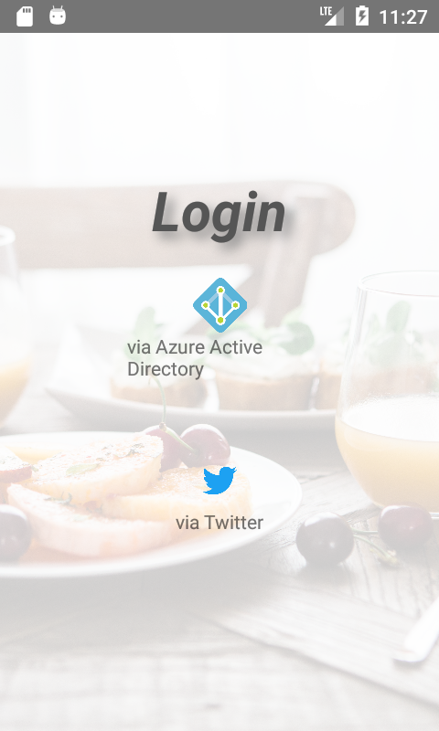
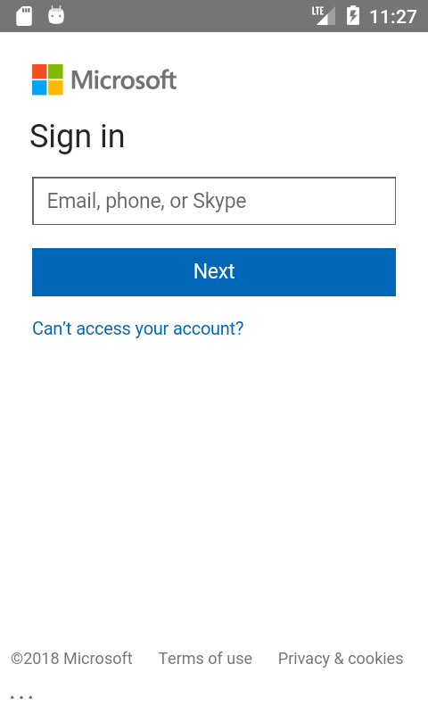
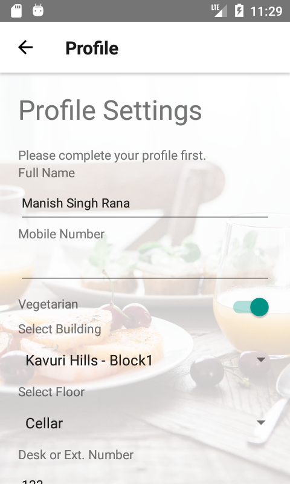
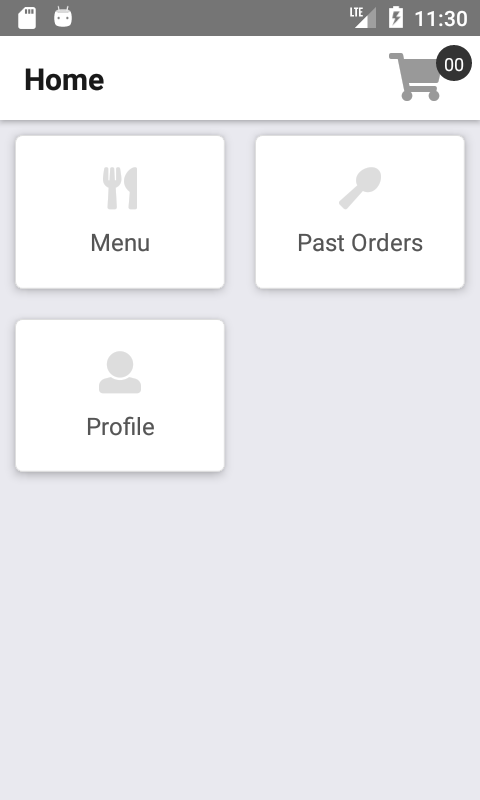
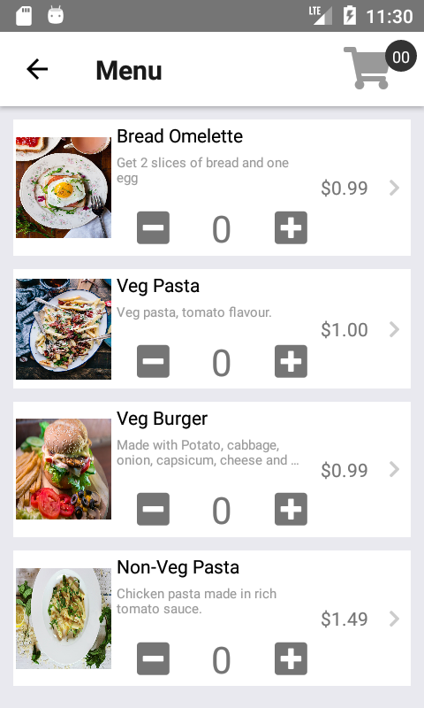
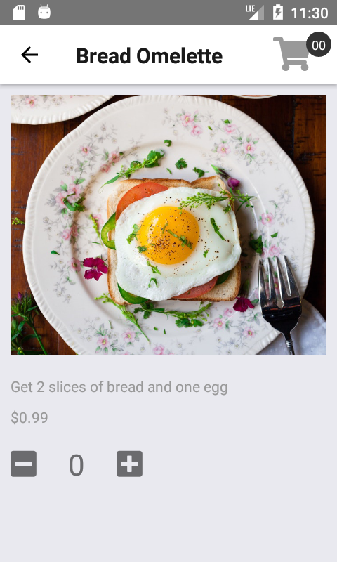
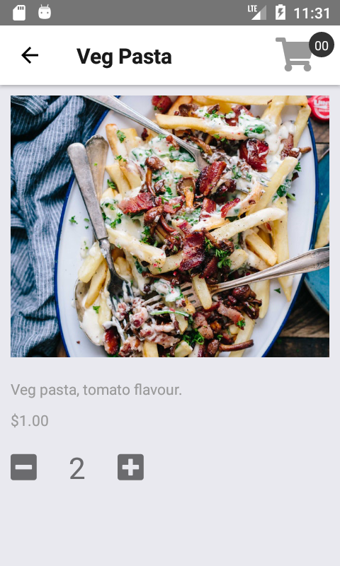

# Meal App
This is an interest-based project, so excuse if something is not according to you or standards.

## Requirement
For this project, I had very simple requirement i.e. I need to learn on Azure and React-Native. So, I started with basic concept of ordering. The app is developed to consider organizational environment where user are the employees of the company who can order their lunch via this app. The office operational staff or the canteen/cafeteria staff can look for today’s order and prepare or bring it accordingly.

Following is the agenda for this application:

1. The app must provide login via Azure Active Directory, and some social media account (I am using twitter) using Azure Authentication API available in Azure App Service.
2. After successful login, based on the user role, i.e. User, Operational or Admin, the app must show relative screens.
3. The app must fetch and store all the data in Azure (I am using Easy Tables).

## Roles in application
### User
The consumers of ordering service. After authentication, the user can do following activities.
1. Can create a new order.
2. Can see all the past orders (currently all, but limit to some time frame).
3. Have option to re-order from past orders.

### Operational
The providers of ordering service. After authentication, these users can perform following activities:
1. Can see today's orders.
2. Option to change order lock timings (no order can be received after set time).
3. Can updated the total billed amount, in case of mismatch.
4. Update status of orders like, preparing, collected by user / available at location, payment received.

### Admin
The owner of ordering service. They can perform following actions:
1. Can see today's orders.
2. Can add items to menu list.
3. Can update existing menu item price.
4. Can block and unblock users.

## Technical Document
This application is consisting of two part, frontend developed using React-Native, and backend services are Azure.

### Azure Configuration
1. Add an App Service to your azure account.
2. Open the App Service created and navigate to 'authentication' section and configure Azure Active Directory and Twitter (follow azure on screen direction to configure them) method.
3. Add the SQL Database of your Azure and in this app service configure the **Data Connection** to the SQL.
4. Now in App Service, navigate to **Quick Start** section and select your development environment. In the first step you can see, database connection is already established (via point 3) otherwise you can add new connection directly from this. Below, you can see section **Create a Table API**, select **Node.js** in this, in order to access Easy Tables data from REST API.

### Mobile App Configuration
1. Install the Android studio and create a AVD (if you are testing for Android only).
1. Make sure, you have Node.js environment setup in your system.
1. Go to **Frontend** folder of this solution.
2. Run the following commands
... ..*`npm install -g react react-native` to install React and React-Native as global package.
... ..*`npm install` to install all the required packages to run mobile application.
3. Also run Command on React Native Project i.e. Frontend folder `react-native link` to link assets folder to Android and iOS project. This will link font-awesome font files to your resource folder (for both iOS and Android) so you can use them in project.
4. Make sure your AVD is running, to test the application, run following command `react-native run-android` to test on Android AVD or `react-native run-ios` to test on iOS device.

## Current Status
1. The Application authentication is completed.
1. Fetching the profile logic is done. On first login, saving the profile is done.
2. Interface to list menu items and single item detail page is done.
3. Cart partially implemented.

## Screenshots

